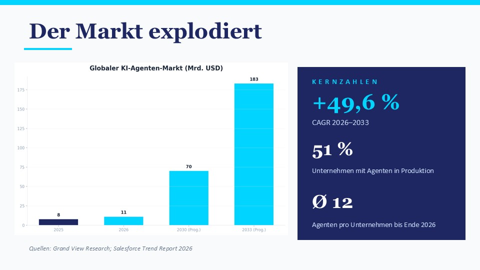

# Präsentations-Workflow für Claude Code

> Automatisierter Workflow zum Erstellen professioneller PowerPoint-Präsentationen mit Claude Code — inklusive Recherche, Diagrammen, Stockbildern und Icons.



## Was ist das?

Ein vollständiger Workflow, mit dem [Claude Code](https://claude.com/product/claude-code) auf Anweisung in natürlicher Sprache PowerPoint-Präsentationen erstellt:

- **Recherche** — entweder eigenständig per Web-Suche oder aus einer mitgelieferten Datei (z.B. Deep Research-Output)
- **Gliederung** — mit proaktiven Vorschlägen zur passenden Visualisierung pro Folie
- **Diagramme** — 10 Chart-Typen (Bar, Line, Pie, Donut, Process, Timeline, Funnel u.a.) per matplotlib
- **Stockbilder** — automatisch von Pixabay heruntergeladen (kommerziell nutzbar)
- **Icons** — aus react-icons (Font Awesome, Material Design)
- **Tabellen** — direkt in pptxgenjs
- **Qualitätskontrolle** — Inhalts- und Layoutprüfung vor dem Speichern

Das Ergebnis ist eine fertige `.pptx`-Datei mit professionellem Design, konsistenter Farbpalette und Sandwich-Struktur (dunkel → hell → dunkel).

## Beispiele

Im Ordner [`beispiele/`](beispiele/) liegen fertige Präsentationen, die mit diesem Workflow erstellt wurden:

- `ki-agenten.pptx` — 5 Folien zum Thema KI-Agenten (Stil: Dunkel & professionell)
- `longevity.pptx` — 5 Folien zum Thema Longevity (Stil: Hell & modern)

## Schnellstart

### Voraussetzungen

- Windows 10/11 (Mac/Linux funktioniert prinzipiell, ist aber nicht getestet)
- Claude Pro oder Max (Claude Code ist nicht im kostenlosen Plan enthalten)
- Internetverbindung

### Installation

Eine ausführliche Schritt-für-Schritt-Anleitung für Anfänger ohne Programmiererfahrung findest du in **[ANLEITUNG.md](ANLEITUNG.md)**.

Kurzfassung für erfahrene Nutzer:

```bash
# 1. Repo klonen
git clone https://github.com/DEIN-USER/presentation-workflow.git
cd presentation-workflow

# 2. JavaScript-Bibliotheken
npm init -y
npm install pptxgenjs react-icons react react-dom sharp

# 3. Python-Bibliotheken
pip install matplotlib Pillow requests

# 4. API-Key konfigurieren
cp .env.example .env
# .env öffnen und PIXABAY_API_KEY eintragen
# (kostenloser Key: https://pixabay.com/api/docs/)

# 5. Claude Code starten und loslegen
claude
> Erstelle eine Präsentation
```

## Wie funktioniert es?

Der Workflow basiert auf einer `CLAUDE.md`-Datei im Workspace-Root, die Claude Code beim Start liest und als Anweisung verwendet. Die Datei enthält einen 8-Schritt-Workflow:

1. **Voraussetzungen prüfen** — Installiert fehlende Abhängigkeiten automatisch
2. **Briefing erfragen** — Thema, Zielgruppe, Folienanzahl, Sprache, Stil, Recherchequelle
3. **Recherche** — Eigenständig oder aus Datei
4. **Gliederung mit Visualisierungs-Plan** — Vorschlag pro Folie zur Bestätigung
5. **Farbpalette festlegen** — themengerecht (KI/Wirtschaft/Bildung/Gesundheit/Kreativ)
6. **Visuelle Assets erstellen** — Charts, Diagramme, Bilder, Icons
7. **PPTX bauen** — mit pptxgenjs nach festen Design-Regeln
8. **Qualitätskontrolle** — Inhaltsprüfung + manuelle visuelle Prüfung durch Nutzer

Die vollständigen Workflow-Anweisungen findest du in **[CLAUDE.md](CLAUDE.md)**.

## Projektstruktur

```
presentation-workflow/
├── CLAUDE.md              ← Anweisungen für Claude Code
├── ANLEITUNG.md           ← Schritt-für-Schritt-Anleitung für Anfänger
├── README.md              ← Diese Datei
├── LICENSE                ← MIT-Lizenz
├── .env.example           ← Vorlage für API-Keys
├── .gitignore             ← Schließt sensible Dateien aus
│
├── helpers/
│   ├── pixabay_search.py  ← Bildersuche & Download
│   └── create_chart.py    ← 10 Chart-Typen via matplotlib
│
├── beispiele/             ← Fertige Beispiel-Präsentationen
│
└── projekte/              ← Hier landen deine Präsentationen
    └── YYYY-MM-thema/
        ├── research/      ← Recherche-Dateien
        └── output/        ← Generierte Dateien
            ├── charts/
            ├── images/
            ├── create_presentation.js
            └── presentation.pptx
```

## Anpassungen

Der Workflow lässt sich leicht anpassen:

- **Eigene Farbpaletten** — in `CLAUDE.md`, Schritt 4 (Tabelle mit Themenbereichen)
- **Weitere Chart-Typen** — in `helpers/create_chart.py` (matplotlib-basiert)
- **Andere Icons** — react-icons unterstützt Font Awesome, Material Design u.v.m.
- **Master-Layouts** — pptxgenjs unterstützt `defineSlideMaster()` für eigene Templates

## Bekannte Einschränkungen

- Pixabay-Bilder sind kommerziell nutzbar, aber bei spezifischen Anfragen (z.B. „Foto eines konkreten Gebäudes") nicht immer passend. Für solche Fälle kann der Workflow auf Bildgenerierungs-APIs erweitert werden.
- Der Workflow ist auf Windows getestet. Auf Mac/Linux sollte er prinzipiell laufen, einzelne Befehle (z.B. PowerShell-spezifische) müssen ggf. angepasst werden.
- pptxgenjs erzeugt PPTX-Dateien, kann aber keine bestehenden PPTX-Master-Dateien einlesen.

## Lizenz

[MIT](LICENSE) — frei nutzbar, auch kommerziell.

## Mitwirken

Pull Requests, Issues und Vorschläge sind willkommen. Besonders interessant:

- Erweiterungen für weitere Chart-Typen
- Master-Layout-Workflow für Branding
- Unterstützung für Bildgenerierungs-APIs (OpenAI, Google)
- Anpassungen für Mac/Linux

## Autoren

Konzipiert und entwickelt von **Prof. Dr. Jaromir Konecny** in Zusammenarbeit mit **Claude** (Opus 4.6 & 4.7) von Anthropic.

- [LinkedIn](https://www.linkedin.com/in/prof-dr-jaromir-konecny-15bb79b6)
- [Blog: Gehirn und KI](https://scilogs.spektrum.de/gehirn-und-ki/)

## Danksagung

- [pptxgenjs](https://github.com/gitbrent/PptxGenJS) — JavaScript-Bibliothek für PPTX
- [Pixabay](https://pixabay.com/) — Kostenlose Stockbilder
- [matplotlib](https://matplotlib.org/) — Diagramme
- [react-icons](https://react-icons.github.io/react-icons/) — Icon-Bibliothek
- [Anthropic](https://www.anthropic.com/) — Claude Code
